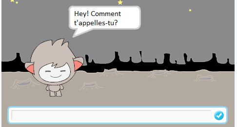

## Un chatbot parlant

Maintenant que vous avez un chatbot avec une personnalité, programmons-le pour qu'il puisse vous parler.

+ Cliquez sur votre personnage chatbot et ajoutez ce code :

	```blocks
		quand ce lutin est cliqué
		demander [Hé! Comment vous appelez-vous ?] et attendre
		dire [Quel charmant!] pendant (2) secondes
	```

+ Cliquez sur votre chatbot pour le tester. Lorsque l'on vous demande votre nom, tapez-le dans la boîte de dialogue en bas de l'étape.

	

+  Votre chatbot répond simplement `Quel nom charmant !` à chaque fois. Vous pouvez personnaliser la réponse de votre chatbot, en vous servant de la réponse de l'utilisateur. Changez le code du chatbot, comme ceci :

	```blocks
		quand ce lutin est cliqué
		demander [Hey! Comment vous appelez-vous?] et attendre
		dire <regroupe [Salut] (Réponse)> pendant (2) secondes
	```

	Pour créer le dernier bloc, vous devrez ajouter un bloc vert `regroupe`{:class="blockoperators"} et déplacer celui-ci sur le bloc `dire`{:class="blocklooks"}.

	

	Vous pouvez alors changer le texte `bonjour` et dire `salut`, et puis déplacer le bloc bleu clair `réponse`{:class="blocksensing"} ( dans la section 'capteur') sur le texte `Monde`.

	

+ Testez ce nouveau programme. Est-ce qu'il marche comme vous le voulez ? Pouvez-vous réparer les problèmes que vous pouvez voir ? (PS: vous pouvez essayer d'ajouter un espace quelque part !)

+ Peut-être que vous voulez stocker le nom de l'utilisateur dans une variable pour que vous puissiez l'utiliser de nouveau plus tard. Créez une nouvelle variable appelée `nom`{:class="blockdata"}. Si vous avez oublié comment faire ceci, le projet 'Ballons' vous aidera.

+ Les informations que vous avez entrées sont déjà stockées dans une variable spéciale appelée `réponse`{:class="blocksensing"}. Allez dans le groupe de blocs 'capteur' et cliquez sur le bloc de réponse pour qu'une case cochante apparaisse. La valeur actuelle dans `réponse`{:class="blocksensing"} devrait alors s'afficher en haut à gauche de l'étape.

+ Une fois que vous avez créé votre nouvelle variable, assurez-vous que le code de votre chatbot ressemble à ceci :

	```blocks
		quand ce lutin est cliqué
		demander [Hey! Comment t'appelles-tu?] et attendre
		[nom v] prend la valeur (réponse)
		dire <regroupe [Salut] (nom)> pendant (2) secondes
	```

+ Si vous testez votre programme de nouveau, vous remarquerez que la réponse est stockée dans le `nom`{:class="blockdata"} en montrant la variable en haut à gauche de l'étape. La variable `nom`{:class="blockdata"} devrait maintenant contenir la même valeur que la variable `réponse`{:class="blocksensing"}.

	

	Si vous ne désirez pas voir les variables sur cette étape, vous pouvez décocher à côté des noms de variables dans les onglets pour les cacher.

--- challenge ---
## Défi : Plus de questions

Programmez votre chatbot pour poser une autre question. Pouvez-vous stocker la réponse dans une variable ?


--- /challenge ---
