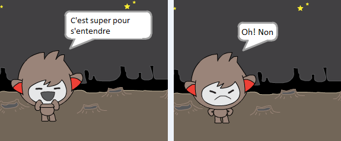

## Prendre des décisions

Vous pouvez programmer votre chatbot pour décider que faire, en fonction des réponses de l'utilisateur.

+ Posons une question à votre chatbot et l'utilisateur qui répond `oui` ou `non`. Voici un exemple, mais vous pouvez changer la question si vous voulez:

	```blocks
		quand ce lutin est cliqué
		demander [Hey! Comment t'appelles-tu?] et attendre
		[nom v] prend la valeur (réponse)
		dire <regroupe [Salut] (nom)> pendant (2) secondes
		demander <regroupe [Tu vas bien] (name)> et attendre
		si ((réponse) = [oui]) alors
   			dire [C'est super!] pendant (2) secondes
		fin
	```

+ Pour tester ce programme correctement, vous devrez le tester deux fois - une fois en tapant "non" et une fois en tapant 'oui'. Vous devriez seulement obtenir une réponse de votre chatbot `if`{:class="blockcontrol"} vous répondez `oui`.

+ Les difficultés avec votre chatbot sont qu'il ne vous donnera pas de réponse si l'utilisateur répond `non`. Vous pouvez réparer cela en changeant le block `if`{:class="blockcontrol"} par un block `if/else`{:class="blockcontrol"}.

	```blocks
		quand ce lutin est cliqué
		demander [Hey! Comment vous appelez-vous ?] et attendre
		[nom v] prend la valeur (réponse)
		dire <regroupe [Salut] (nom)> pendant (2) secondes
		demander <regroupe [Vous allez bien?] (nom)> et attendre
		si ((réponse)=[oui]) alors
			dire [C'est super!] pendant (2) secondes
		sinon
			dire [Oh non!] pendant (2) secondes
		end
	```

+ Si vous testez votre code, vous verrez maintenant que vous obtenez une réponse quand vous répondez 'oui' ou 'non'. Votre chatbot devrait répondre 'c'est super !' quand vous répondez 'oui', mais répondrez avec 'Oh non!' quand vous tapez quoi que ce soit d'autre que 'oui' (`sinon`{:class="blockcontrol"} signifie ' sinon ').

	

+ Vous pouvez mettre n'importe quel code à l'intérieur d'un block `si`{:class="blockcontrol"} ou `sinon`{:class="blockcontrol"}, et non seulement faire parler votre chatbot. Par exemple, vous pouvez changer le costume du chatbot pour correspondre à la réponse.

	Si vous regardez les costumes de votre chatbot, vous pouvez voir qu'il y en a plusieurs. (Sinon, vous pouvez toujours en ajouter vous-même!)

	

	Vous pouvez utiliser ces costumes dans le cadre de la réponse de votre chatbot, en utilisant ce code :

	```blocks
		quand ce lutin est cliqué
		basculer sur costume [nano-a v]
		demander [Hey! Comment vous appelez-vous ?] et attendre
		[nom v] prend la valeur (réponse)
		dire <regroupe [Salut] (nom)> pendant (2) secondes
		demander <regroupe [Vous allez bien?] (nom)> et attendre
		si ((réponse)=[oui]) alors
			basculer sur costume [nano-c v]
			dire [C'est super pour entendre!] pendant (2) secondes
		sinon
			basculer sur costume [nano-d v]
			dire [Oh non!] pendant (2) secondes
		end
	```
  
	

--- challenge ---
## Défi : Plus de décisions

Programmez votre chatbot pour lui poser une autre question - quelque chose avec un 'oui' ou 'aucune' réponse. Votre chatbot peut-il répondre à la question?


--- /challenge ---
